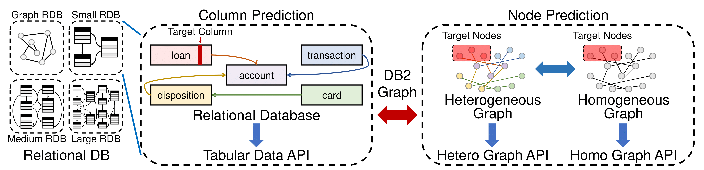

[testing-image]: https://github.com/JiaxuanYou/DBGym/actions/workflows/testing.yml/badge.svg
[testing-url]: https://github.com/JiaxuanYou/DBGym/actions/workflows/testing.yml
[linting-image]: https://github.com/JiaxuanYou/DBGym/actions/workflows/linting.yml/badge.svg
[linting-url]: https://github.com/JiaxuanYou/DBGym/actions/workflows/linting.yml

<div align="center">

# DBGym
[![Testing Status][testing-image]][testing-url]
[![Linting Status][linting-image]][linting-url]

</div>

# Overview

```bash
pip install dbgym	 # Install DBGym
```

DBGym is a platform designed to facilitate ML research and application on databases.
With less than **5 lines of code**, you can point to your database, write the predictive query you want, and DBGym will output the predictions along with your database.

# Installation

Prebuilt DBGym can be easily installed with `pip`: (tested with Python 3.10 and above)

```bash
pip install dbgym
```

Alternatively, you can install latest DBGym version from our code repository:

```bash
git clone https://github.com/JiaxuanYou/DBGym.git
pip install -e . 
```


# DBGym makes ML on Relational DBs simple

In the current release, DBGym focuses on relational databases (databases with multiple tables), which can be as simple as a directory of CSV or Parquet files. Here we show a simple example of what DBGym can help you achieve.

## Example DBGym use case

You may have the following CSV files in your directory `database`, each representing a table
```bash
├── database
│   ├── user.csv
│   ├── item.csv
│   └── trans.csv
```

For example, `user.csv` may look like this:

| _user | x | y | time |
| -------- | -------- | -------- | -------- |
| 0 | 0.1 | A | 2021/01/01
| 1 | 0.8 | A | 2022/02/01
| 2 | 0.5 | B | 2023/05/01
| 3 | 0.5 | N/A | 2024/08/01

Your goal is to **leverage the full database** (not just the `user.csv` table) to predict the unknown values in column `y` in `user.csv`.

Let's pulse here - the simple task of predicting unknown column values is in fact extremely expressive. It can express classification or regression tasks; it can represent time series prediction tasks suppose the N/A values are temporally split; it can represent recommendation tasks by prediction pairs of user and item IDs; it can unify node, edge and graph-level prediction tasks on graphs by saving (heterogeneous) graphs as multiple tables... If we are creative, we can do so many things with the capability of predicting unknown column values.

## What DBGym can do for you

DBGym defines a simple declarative **predictive query** to describe the prediction task above -- `user.y`. The predictive query `user.y` indicates that you want to set up an ML prediction task for column `y` in table `user`, based on the full database's information. DBGym will automatically set up the ML prediction pipeline, including splitting the train/val/test sets, training an ML model, getting evaluation metrics for train/val/test sets, and returning `user_pred.csv` where any missing N/A values will be replaced with DBGym predictions.

To solve a given predictive query, DBGym provide a variety of ML models from tabular ML to graph ML communities, including: 

| DBGym data API | Model |
| -------- | -------- |
| Tabular | XGBoost, MLP | 
| Graph | GCN, GraphSAGE, GIN, GAT | 
| Heterogeneous graph | HGCN, HGT | 

You can also easily create your own models and register them to DBGym. We hope to integrate more ML models to DBGym, and we sincerely appreciate your pull requests!

DBGym is an ongoing research project serving the vibrant open-source community. We sincerely welcome new ideas, use cases, and pull requests to extend DBGym's capability!


# DBGym Quick Start

## 0 Your first DBGym experiment

With less than 5 lines of code, you can set up and carry out experiments using DBGym.

```Python
from dbgym.run import run
from dbgym.config import get_config

config = get_config()
stats = run(config)
```

The expertiment stats and predictions are generated in the `output` directory by default.

## 1 Customize DBGym experiments using RDBench datasets

For users who want to customize DBGym experiments, we provide two ways to customize configuration: using Python and/or using `YAML` config file. Refer to [`dbgym/config.py`](dbgym/config.py) for all the available configurations.

**Customize configs with Python**

You can set the customized predictive query for a given dataset by specifying in the Python code, for example:

```Python
from dbgym.run import run
from dbgym.config import get_config

config = get_config()
# point to a dataset available in RDBench
config.merge_from_list(['dataset.name', 'rdb1-ather'])  
# predictive query. Format: table_name.column_name
config.merge_from_list(['dataset.query', 'entry_examination.Cholesterol'])
stats = run(config)
```

**Customize configs with YAML file**

Alternatively, you can write customized config in a YAML file, e.g., `config_gcn.yaml`, and load with DBGym:

```Python
from dbgym.run import run
from dbgym.config import get_config

config = get_config()
config.merge_from_file('config_gcn.yaml')
stats = run(config)
```

where the yaml `config_gcn.yaml` can be defined as follow:

```yaml
# Example Experiment Configuration for GCN

train:
  epoch: 200

model:
  name: 'GCN'
  hidden_dim: 128
  layer: 3

optim:
  lr: 0.001
```

## 2 Apply DBGym to your own database datasets

You can also easily apply DBGym to your own database datasets. To start, you can first organize your customized data as follows:

```
your_dataset_path
├── your_dataset_1
│   ├── user.csv
│   ├── item.csv
│   └── ...
├── your_dataset_2
└── ...
```

Within each CSV file, DBGym assumes that most of the table columns can be arbitrarily named, except for the key columns, where you should *follow the naming convention*, where the primary key column for table `table` is named as `_table`. For example, the column names for each CSV file may look like:
```bash
user.csv:	_user, x1, x2, ...
item.csv:	_item, Feature1, Feature2, ...
```
where the special columns begin with `_` indicate key columns, and the remaining columns (can be arbitrarily named) are regarded as feature columns. For example, `_user` is the primary key column for `user.csv`, which should save the unique ID for each user; other tables could also refer to user ID information, e.g., by adding `_user` column in `trans.csv`, in which case `_user` is the foreign key column in `trans.csv` that could have non-unique values.


Then, you can point DBGym to the dataset diretory, specify the dataset you want, and write a simple predictive query by point to any feature column:

```Python
from dbgym.run import run
from dbgym.config import get_config

config = get_config()
config.merge_from_list(['dataset.dir', 'your_dataset_path'])
config.merge_from_list(['dataset.name', 'your_dataset_1'])
config.merge_from_list(['dataset.query', 'target.x1'])
stats = run(config)
```

Finally, DBGym will generate experiment logs and predictions in the `output` directory by default. The predictions for column `x1` of `target.csv` will be saved as `target_pred.csv`.

Alternatively, you can customize your output directory by adding the following line

```Python
config.merge_from_list(['log_dir', 'your_output_path'])
```


## 3 Include customized models to DBGym

You can further easily register your customized models to DBGym and run experiment with them. This is especially helpful if you want to benchmark your proposed model with DBGym. 
You may follow the instructions below to customize your own model and potentially contribute back to DBGym repository.

To start, instead of using the simple `pip install dbgym` method, you should:
```bash
git clone https://github.com/JiaxuanYou/DBGym.git
pip uninstall dbgym  # uninstall existing DBGym
pip install -e .  # install with developer mode
```

Then, you can customize your own model in `dbgym/contribute/your_model.py`:

```Python
from dbgym.register import register

class YourModel(nn.Module):
    ...

your_model_type = 'tabular_model' or 'graph_model'
register(your_model_type, 'your_model_name', YourModel)
```

Next, you can use DBGym with your customized model

```Python
from dbgym.run import run
from dbgym.config import get_config

config = get_config()
config.merge_from_list(['model.name', 'your_model_name'])
stats = run(config)
```

# DBGym Feature Highlights

<div align="center">

<b><br>Figure 1: An overview of DBGym design principle.</b>
</div>


**1. Unified Task Definition for Various Data Formats.**
- To meet the requirements of diverse users, DBGym provides 3 kinds of APIs: tabular data, homogeneous graphs and heterogeneous graphs.
- For all these data formats, we propose a unified task definition, enabling results comparison between models for different formats of data.

**2. Hierarchical Datasets with Comprehensive Experiments** 
- Via RDBench, DBGym provides 11 datasets with a range of scales, domains, and relationships. 
- These datasets are categorized into three groups based on their relationship complexity.
- Extensive experiments with 10 baselines are carried out on these datasets.

**3. Easy-to-use Interfaces with Robust Results** 
- Highly modularized pipeline.
- Reproducible experiment configuration.
- Scalable experiment management.
- Flexible user customization.
- Results reported are averaged over the same dataset and same task type (classification or regression).

DBGym has enabled RDBench, a user-friendly toolkit for benchmarking ML methods on relational databases. Please refer to our paper for more details: *[RDBench: ML Benchmark for Relational Databases](tbf)*, arXiv, Zizhao Zhang*, Yi Yang*, Lutong Zou*, He Wen*, Tao Feng, Jiaxuan You.


# Logging

## Logs and predictions

After running DBGym, the logs and predictions are saved to an output directory named as `output` by default. Moreover, the command line output will also indicate the path where logs and predictions are saved. For example

```
Logs and predictions are saved to Datasets/output/rdb2-bank/loan.Status_MLP_42_20231024_151211
```

## Visualisation

To see the visualisation of training process, go into the output directory and run

```bash
tensorboard --logdir .
```

Then visit `localhost:6006`, or any other port you specified.


