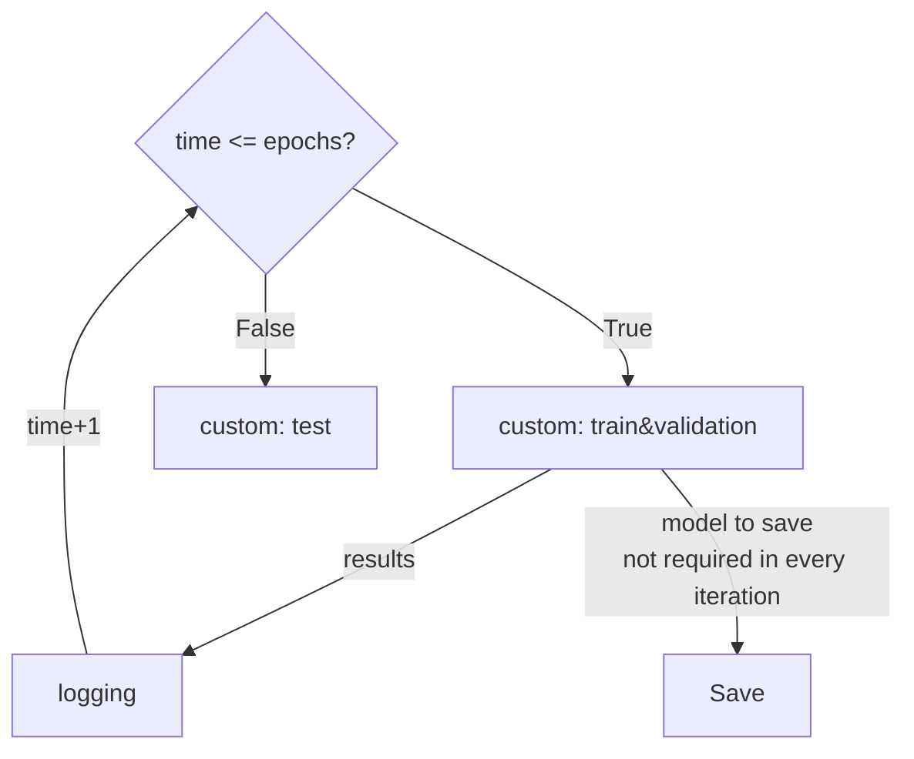

# DeepGym

DeepGym for DB learning

---

To see the visualisation of training process, go into the log dir and run

```
tensorboard --logdir .
```

# Design Schema
## Train


```mermaid
graph TB;
	J{time &lt= epochs?}--True-->A;
	A[custom: train&validation] --results--> B[logging];
	B--time+1-->J;
	J --False--> K[custom: test];
	A --model to save\nnot required in every iteration-->L[Save]
```
