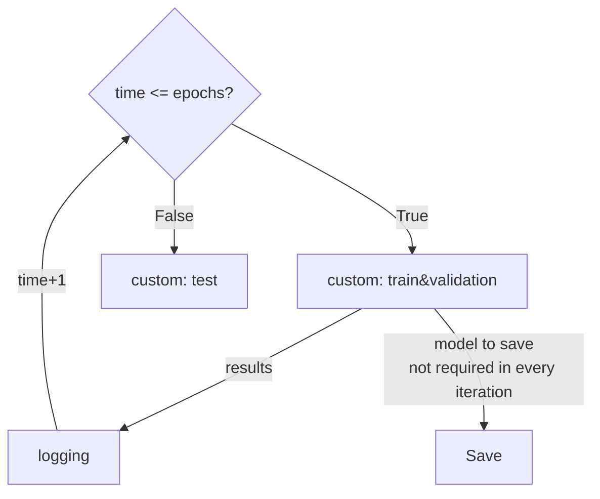

# DeepGym
DeepGym is a platform designed to facilitate hierarchical, robust, and reproducible ML research on
relational databases.
DeepGym provides a user-friendly toolkit for the benchmark RDBench, which is proposed in *[RDBench: ML Benchmark for Relational Databases](tbf)*, arXiv, Zizhao Zhang*, Yi Yang*, Lutong Zou*, He Wen*, Tao Feng, Jiaxuan You.


### Highlights

**1. Unified Task Definition for Various Data Formats.**
- To meet the requirements of diverse users, DeepGym provides 3  kinds of data: tabular data, homogeneous graphs and heterogeneous graphs.
- For all these data formats, we propose a unified task definition, enabling results comparison between models for different formats of data.

**2. Hierarchical Datasets with Comprehensive Experiments** 
- DeepGym provides 11 datasets with a range of scales, domains, and relationships. 
- These datasets are categorized into three groups based on their relationship complexity.
- Extensive experiments with 10 baselines are carried out on these datasets.

**3. Easy-to-use Interfaces with Robust Results** 
- Results reported are averaged over the same dataset and same task type (classification or regression)
- 

### Example use cases
- *[RDBench: ML Benchmark for Relational Databases](tbf)*, Zizhao Zhang, Yi Yang, Lutong Zou, He Wen, Tao Feng, Jiaxuan You.


## How to use DeepGym?

In DeepGym, an experiment is fully specified by a `.yaml` file.

Unspecified configurations in the `.yaml` file will be populated by the default values in 
[`deepgym/config.py`](deepgym/config.py).
For example, in [`config.yaml`](config.yaml), 
there are configurations on seed, dataset, training, model, GNN, optim, etc.
Concrete description for each configuration is described in 
[`deepgym/config.py`](deepgym/config.py).

# Logging
## Visualisation

To see the visualisation of training process, go into the log dir and run

```
tensorboard --logdir .
```
Then visit `localhost:6006`, or any other port you specified.
## Text
To see the text document of training process, go into the log dir and run

```
python3 ../deepgym/logger.py
```
This line will generate a `log.txt` in the directory.

# Design Schema
## Train




## CI CD test
We carried out CI CD test on the DeepGym, the content of the test includes data incoming, model training, etc., which can be seen in detail [`deepgym/test_mlp.py`](deepgym/test_mlp.py)


