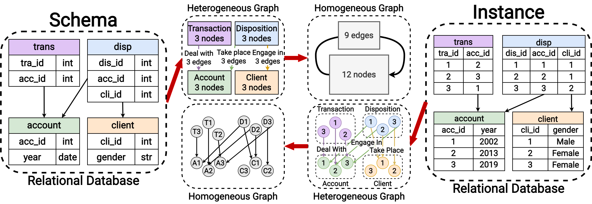

[testing-image]: https://github.com/JiaxuanYou/DBGym/actions/workflows/testing.yml/badge.svg
[testing-url]: https://github.com/JiaxuanYou/DBGym/actions/workflows/testing.yml
[linting-image]: https://github.com/JiaxuanYou/DBGym/actions/workflows/linting.yml/badge.svg
[linting-url]: https://github.com/JiaxuanYou/DBGym/actions/workflows/linting.yml

<div align="center">

# DBGym
[![Testing Status][testing-image]][testing-url]
[![Linting Status][linting-image]][linting-url]

</div>

DBGym is a platform designed to facilitate ML research and application on databases.
With less than **5 lines of code**, you can point to your database, write the predictive query you want, and DBGym will output the predictions along with your database.

In the current release, DBGym focuses on relational databases (databases with multiple tables). In practice, it simply means that you would need to prepare your data into a directory with CSV or Parquet files, each representing a table. Then, you would need to prepare the column names in each file according to a standard naming convention: 
For example, you may have the following files in your database directory
```bash
user.csv	item.csv	trans.csv
```
Then, the column names for each file should look like
```bash
user.csv:	_user, x1, x2, ...
item.csv:	_item, x1, x2, ...
trans.csv:	_trans, _user, _item, x1, x2, ...
```


## Highlights

DBGym has enabled RDBench, a user-friendly toolkit for benchmarking ML methods on relational databases. Please refer to our paper for more details: *[RDBench: ML Benchmark for Relational Databases](tbf)*, arXiv, Zizhao Zhang*, Yi Yang*, Lutong Zou*, He Wen*, Tao Feng, Jiaxuan You.


<div align="center">
  
  <b><br>Figure 1: An overview of our proposed benchmark RDBench.</b>
</div>


**1. Unified Task Definition for Various Data Formats.**
- To meet the requirements of diverse users, DBGym provides 3 kinds of data: tabular data, homogeneous graphs and heterogeneous graphs.
- For all these data formats, we propose a unified task definition, enabling results comparison between models for different formats of data.

**2. Hierarchical Datasets with Comprehensive Experiments** 
- DBGym provides 11 datasets with a range of scales, domains, and relationships. 
- These datasets are categorized into three groups based on their relationship complexity.
- Extensive experiments with 10 baselines are carried out on these datasets.

**3. Easy-to-use Interfaces with Robust Results** 
- Highly modularized pipeline
- Reproducible experiment configuratio
- Scalable experiment management
- Flexible user customization
- Results reported are averaged over the same dataset and same task type (classification or regression)
  

### Example use cases
- *[RDBench: ML Benchmark for Relational Databases](tbf)*, Zizhao Zhang, Yi Yang, Lutong Zou, He Wen, Tao Feng, Jiaxuan You.


## What is DBGym?

**1. Proposed Datasets**


<div align="center">

<b><br>Figure 2: The procedure transforming relational databases to graphs.</b>
</div>


## How to use DBGym?

**1. How to set the configuration?**
- In DBGym, an experiment is fully specified by a `.yaml` file. For example, in [`config.yaml`](config.yaml), there are configurations on seed, dataset, training, model, GNN, optim, etc.
- Unspecified configurations in the `.yaml` file will be populated by the default values in 
[`dbgym/config.py`](dbgym/config.py).
- Concrete description for each configuration is also described in [`dbgym/config.py`](dbgym/config.py).


## CI CD test
We carried out CI CD test on the DBGym, the content of the test includes data incoming, model training, etc., which can be seen in detail [`dbgym/test_mlp.py`](dbgym/test_mlp.py)


# Logging
## Visualisation

To see the visualisation of training process, go into the log dir and run

```bash
tensorboard --logdir .
```
Then visit `localhost:6006`, or any other port you specified.
## Text
To see the text document of training process, go into the log dir and run

```bash
python3 ../dbgym/logger.py
```
This line will generate a `log.txt` in the directory.

<!--
Lugar deleted this part for the time being, since train process is not designed according to the graph yet. 
# Design Schema
## Train

```mermaid
graph TB;
	J{time &lt= epochs?}--True->A;
	A[custom: train&validation] --results-> B[logging];
	B--time+1->J;
	J --False-> K[custom: test];
	A --model to save\nnot required in every iteration->L[Save]
```
-->


