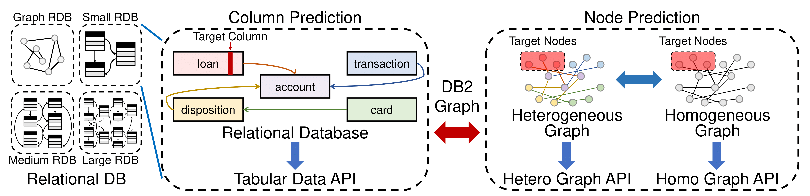

DBGym Feature Highlights
========================

1. Unified Task Definition for Various Data Formats.
- To meet the requirements of diverse users, DBGym provides 3 kinds of APIs: tabular data, homogeneous graphs and heterogeneous graphs.
- For all these data formats, we propose a unified task definition, enabling results comparison between models for different formats of data.

2. Hierarchical Datasets with Comprehensive Experiments 
- Via RDBench, DBGym provides 11 datasets with a range of scales, domains, and relationships. 
- These datasets are categorized into three groups based on their relationship complexity.
- Extensive experiments with 10 baselines are carried out on these datasets.

3. Easy-to-use Interfaces with Robust Results 
- Highly modularized pipeline.
- Reproducible experiment configuration.
- Scalable experiment management.
- Flexible user customization.
- Results reported are averaged over the same dataset and same task type (classification or regression).

Logs and Predictions
--------------------

After running DBGym, the logs and predictions are saved to an output directory named as `output` by default. Moreover, the command line output will also indicate the path where logs and predictions are saved. For example

.. code-block:: bash

    Logs and predictions are saved to Datasets/output/rdb2-bank/loan.Status_MLP_42_20231024_151211

Visualization with Tensorboard
------------------------------

To see the visualization of the training process, you can go into the output directory and run

.. code-block:: bash
    
    tensorboard --logdir .